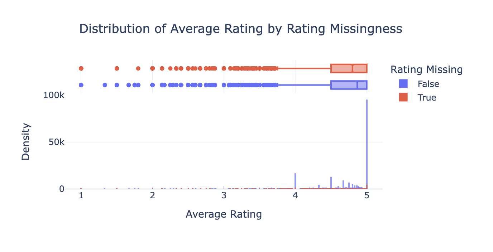

# How to Predict Recipe Ratings on Food.com

By: Feiwei Peng and Ashley Chu

## Introduction

In this project, we examine, analyze and try to predict the popularity of recipes from food.com, which we defined by a recipe’s average rating. We were interested in this question due to our personal interests in cooking and finding highly rated and delicious recipes, and were wondering what factors could contribute to making a recipe of such qualities. 

Our dataset was scraped from food.com by Bodhisattwa Prasad Majumder, Shuyang Li, Jianmo Ni and Julian McAuley for their paper called “Generating Personalized Recipes from Historical User Preferences”, and consists of two CSV files containing recipe attributes and recipe interactions (ratings and reviews). We only used the recipes and reviews posted since 2008 since the original data was quite large, and thus ended up with 83,782 rows in our recipe dataset and 731,927 rows in our interactions dataset. We merged the two dataframes, and our columns of interest in the resulting dataframe are:

| Column             | Description
| :----------------- | :----------------------------------------|
| `'id'`             | Recipe ID                     |
| `'minutes'`        | Minutes to prepare recipe      |  
| `'tags'`           | Food.com tags for recipe|
| `'nutrition'`      | Nutrition information in the form [calories (#), total fat (PDV), sugar (PDV), sodium (PDV), protein (PDV), saturated fat (PDV), carbohydrates (PDV)]; PDV stands for “percentage of daily value” |
| `'n_steps'`        | Number of steps in recipe        |
| `'n_ingredients'`  | Number of ingredients in recipe  |
| `'rating'`    | Rating given        |

Using this data, we were interested in whether the number of calories in a recipe could help predict its popularity, as well as discover which other factors could contribute to better predicting how well a recipe will do on food.com. Do people prefer making and eating higher calorie foods? What makes a recipe popular -- for example: is it how long it takes, how many ingredients it uses, how many calories it yields, or how much protein it has in it? Thus with these questions in mind, we moved onto the data cleaning and exploratory data analysis steps.

## Data Cleaning and Exploratory Data Analysis

1. As briefly explained in the introduction, we first combined the recipe and interactions datasets with a left join in order to preserve all the recipes, and not introduce reviews or ratings for recipes we don't have data on.
2. Next we did a data quality check and cleaned up the resulting dataframe by converting ratings of 0 to NaN, as rather than represent the lowest rating possible, 0 appears when users do not give the recipe a rating and opt only to write a review instead. Thus, including 0 rating values in our analysis would negatively skew our results, as it misleadingly quantifies a low rating where in reality, there was none given. Later, we also decided handle the resulting missing values by dropping the NaN values for the Baseline Model, since we are measuring average rating and do not need to consider null ratings (instances when a user did not leave a rating).
3. We then created a column with the aggregated mean rating per recipe, since most recipes were reviewed and rated multiple times and we wanted to capture a recipe's overall "popularity" in a single summary statistic. We put the average ratings into a new column called 'avg_rating'.
4. Next, we performed transformations, such as converting the submitted dates into pandas DateTime objects in case we later wanted to include 'year' data in our analysis.
5. Likewise, we extracted nutrition values such as 'calories' and 'total_fat' into single values in separate columns to be able to use them in our analysis as well.
6. Finally, we quantified and aggregated 'num_tags' and 'num_reviews' for each recipe into separate columns in order to quantify the tag and review data.

Here is the head of our resulting dataframe:

| name                                 |     id |   minutes |   contributor_id | submitted           | tags                                                                                                                                                                                                                        | nutrition                                    |   n_steps | steps                                                                                                                                                                                                                                                                                                                                                                                                                                                                                                                                                                                                                                                                                                                                                                                                                              | description                                                                                                                                                                                                                                                                                                                                                                       | ingredients                                                                                                                                                                    |   n_ingredients |          user_id | date       |   rating | review                                                                                                                                                                                                                                                                                                                                           |   avg_rating |   year |   calories |   total_fat |   num_tags |   num_reviews |
|:-------------------------------------|-------:|----------:|-----------------:|:--------------------|:----------------------------------------------------------------------------------------------------------------------------------------------------------------------------------------------------------------------------|:---------------------------------------------|----------:|:-----------------------------------------------------------------------------------------------------------------------------------------------------------------------------------------------------------------------------------------------------------------------------------------------------------------------------------------------------------------------------------------------------------------------------------------------------------------------------------------------------------------------------------------------------------------------------------------------------------------------------------------------------------------------------------------------------------------------------------------------------------------------------------------------------------------------------------|:----------------------------------------------------------------------------------------------------------------------------------------------------------------------------------------------------------------------------------------------------------------------------------------------------------------------------------------------------------------------------------|:-------------------------------------------------------------------------------------------------------------------------------------------------------------------------------|----------------:|-----------------:|:-----------|---------:|:-------------------------------------------------------------------------------------------------------------------------------------------------------------------------------------------------------------------------------------------------------------------------------------------------------------------------------------------------|-------------:|-------:|-----------:|------------:|-----------:|--------------:|
| 1 brownies in the world    best ever | 333281 |        40 |           985201 | 2008-10-27 00:00:00 | ['60-minutes-or...'] | [138.4, 10.0, 50.0, 3.0, 3.0, 19.0, 6.0]     |        10 | ['heat the oven to 350f ...']                                                  | these are the most; chocolatey, moist, r...                                                                                                              | ['bittersweet chocolate', 'unsalted butter'...] |               9 | 386585           | 2008-11-19 |        4 | These were pretty good, but took forever to bake.  I would send it ended up being almost an hour!...                                                                                   |            4 |   2008 |      138.4 |          10 |         14 |             1 |
| 1 in canada chocolate chip cookies   | 453467 |        45 |          1848091 | 2011-04-11 00:00:00 | ['60-minutes-or-less', 'time-to-make', 'cuisine', ...]                                                               | [595.1, 46.0, 211.0, 22.0, 13.0, 51.0, 26.0] |        12 | ['pre-heat oven the 350 degrees f...'] | this is the recipe that we use at my school cafet...                                                                                                                                            | ['white sugar', 'brown sugar', 'salt', ...]                    |              11 | 424680           | 2012-01-26 |        5 | Originally I was gonna cut the recipe in... |            5 |   2011 |      595.1 |          46 |          9 |             1 |
| 412 broccoli casserole               | 306168 |        40 |            50969 | 2008-05-30 00:00:00 | ['60-minutes-or-less', 'time-to-make', ...]                                                                        | [194.8, 20.0, 6.0, 32.0, 22.0, 36.0, 3.0]    |         6 | ['preheat oven to 350 degrees...']                                                                                                                                                                                                                                                                                                                              | since there are already ... | ['frozen broccoli cuts', ...]          |               9 |  29782           | 2008-12-31 |        5 | This was one of the best broccoli cass...                                                                                                                                  |            5 |   2008 |      194.8 |          20 |         10 |             4 |
| 412 broccoli casserole               | 306168 |        40 |            50969 | 2008-05-30 00:00:00 | ['60-minutes-or-less', 'time-to-make', ...]                                                                        | [194.8, 20.0, 6.0, 32.0, 22.0, 36.0, 3.0]    |         6 | ['preheat oven to 350 degrees...']                                                                                                                                                                                                                                                                                                                              | since there are... | ['frozen broccoli cuts', 'cream of chicken soup',...]          |               9 |      1.19628e+06 | 2009-04-13 |        5 | I made this ...                                                                                                                                                                               |            5 |   2008 |      194.8 |          20 |         10 |             4 |
| 412 broccoli casserole               | 306168 |        40 |            50969 | 2008-05-30 00:00:00 | ['60-minutes-or-less', 'time-to-make', ...]                                                                        | [194.8, 20.0, 6.0, 32.0, 22.0, 36.0, 3.0]    |         6 | ['preheat oven to 350 degrees...']                                                                                                                                                                                                                                                                                                                              | since there are already ... | ['frozen broccoli cuts', ...]          |               9 | 768828           | 2013-08-02 |        5 | Loved t....                                                                                                                                                     |            5 |   2008 |      194.8 |          20 |         10 |             4 |

For our exploratory data analysis, we made various univariate and bivariate visualizations.

### Univariate Analyses:

This histogram illustrates the distribution of average ratings for recipes in the dataset, with bins spanning from 0 to 5. The majority of the ratings are heavily concentrated around 5, indicating that most recipes received highly positive feedback. Ratings between 4 and 5 are also relatively common, showing an overall trend of satisfaction among users. Conversely, ratings below 3 are sparse, suggesting that negative reviews or dissatisfaction are rare occurrences in the dataset. This skewed distribution highlights a strong bias toward higher ratings, which could be due to user preferences, selective reviewing, or the quality of recipes available on the platform. We should be careful if we want to predict rating because the data is imbalanced.

This histogram illustrates the distribution of years for recipes in the dataset, with bins spanning from 2008 to 2018. The majority of the ratings are heavily concentrated around 2008-2012, indicating that most recipes were posted closer to 2008 than present day.

This histogram illustrates the distribution of calories for recipes in the dataset, with bins spanning from 0-200 to 20,000-30,0000. The majority of the ratings are heavily concentrated around 0-1,000, indicating that most recipes have snack-to-meal ranges for calories.

### Bivariate Analyses:

Here we plotted Year vs. Calories to see if there was a decrease as people become more calorie-conscious in the present:

This scatter plot shows the relationship between the year of recipe submissions and their calorie counts, with points colored by the average rating. While calorie counts vary widely across years, recipes with lower calories appear more frequent, and calories of recipes seems to decrease for recent years. Higher-rated recipes (yellow) are distributed across different calorie levels, suggesting that rating is not strongly correlated with calorie counts.

Here we plotted Number of Reviews vs. Calories to see if there was a visual correlation:

This scatter plot shows the relationship between the calorie of recipes and the number of reviews they received, with points colored by the average rating. Most recipes cluster around lower calorie counts (below 2,000), with a wide range in the number of reviews. However, recipes with large number of reviews tend to have 3-4 stars rating, probably because there are more variations of ratings for recipes with high popularity.

### Interesting Aggregates

As for interesting aggregates, the pivot table below highlights the average calories per recipe by year, revealing a steady increase in caloric content from 2008 to 2018. This trend may reflect societal shifts towards richer, more indulgent recipes, changes in user preferences, or evolving food trends on the platform, such as the growing popularity of comfort foods or festive dishes. The sharp rise in 2017 and 2018 could also indicate external factors, like cultural influences or platform dynamics promoting specific types of recipes. Understanding this trend provides valuable insights into dietary patterns and cultural shifts, offering opportunities for further analysis of recipe types or external influences shaping these changes.

## Assessment of Missingness

### NMAR Analysis

We believe that the rating column in the dataset is NMAR (Not Missing At Random) because ratings of 0 were intentionally set to NaN. A 0 rating likely indicates that users were either extremely dissatisfied with the recipe or chose not to leave a rating intentionally due to dissatisfaction. Since the missingness is directly tied to users' dissatisfaction, it depends on the unrecorded or implicit sentiment of their experience, making it NMAR. To potentially make the missingness MAR (Missing At Random), we would need additional data, such as the sentiment of the review text. If we could associate missing ratings with negative sentiments in the reviews, we could infer that the missingness is explained by the sentiment, thus making the missingness MAR.

### Missingness Dependency

We performed a missingness hypothesis test, and found that the observed difference in the means of avg_rating between recipes with missing and non-missing ratings was 0.0630. The resulting p-value was 0.0, indicating strong evidence to reject the null hypothesis. This suggests that the missingness of rating depends on avg_rating. Therefore, the missingness of rating is Missing at Random (MAR) because the missingness can be explained by another observed column in the dataset.

The observed difference in the mean minutes between recipes with missing and non-missing ratings was 51.45. The resulting p-value was around 0.1, which is greater than the commonly used significance threshold of 0.01 (1%). Since the p-value is not low enough to reject the null hypothesis, we conclude that there is insufficient evidence to suggest that the missingness of rating depends on the minutes column. Therefore, the missingness of rating is not MAR (Missing at Random) with respect to minutes.

## Hypothesis Testing

- Null hypothesis: Recipes posted in 2008 and 2018 have the same distributions of calories across recipes.
- Alternative hypothesis: Recipes posted in 2008 and 2018 do not have the same distributions of calories across recipes.
- For our test statistic, we used the K-S statistic because we wanted to see if these two years had different distributions.
- Since the p-value is very small (2.026287255508594e-05), far below p = 0.05, we can see from this hypothesis test that the caloric distributions from 2008 and 2018 seem to be very different.

As you can see from the visualization below, our observed K-S statistic is far below the expected statistics we would get if the distributions of calories for the two years were the same. Furthermore, since the p-value is much smaller than our threshold of 0.05, we believe the distributions of calories from 2008 and 2018 to be different.

## Framing a Prediction Problem

Our prediction problem is trying to predict a recipe's average rating based on the number of calories it has, which is a regression problem. The response variable is the average rating, and we chose it because we think it is an adequate measure of popularity. We used Mean-Squared-Error to evaluate our model because it works for regression models. At time of prediction for our baseline model, we begin looking only at the total calories in a recipe to predict the average rating.

## Baseline Model

For our baseline model, we used a pipeline to fit a linear regression model to the data, using the number of calories and number of steps (two quantitative attributes) to predict how a recipe would be rated. We extracted the data from the nutrition list and step list and aggregated the number of steps to get these attributes. Our model had a MSE of 0.24771574237250418, and we don't believe our current model is very good because it mainly relies on an intercept placed near where all the recipe ratings are clustered (in the high 4.5-4.9 star range). Perhaps the data is skewed, but we think we could still make a better model that could make more accurate predictions.

## Final Model

The final model leverages a Random Forest Regressor, chosen for its ability to capture complex non-linear relationships and interactions between features without requiring extensive data preprocessing. Numerical features such as year, number of ingredients, number of steps, nutrition information (calories, total fat, sugar, sodium, protein, saturated fat, carbohydrates), and rating were included because they directly relate to recipe characteristics and user preferences. For example, year might capture trends in recipe popularity, while nutritional information provides a quantitative measure of healthiness, which could influence ratings. The number of ingredients and steps reflect the complexity of the recipe, which might align with user satisfaction or difficulty level.

In addition to these numerical features, text reviews were incorporated using TF-IDF to extract meaningful patterns in user feedback. To handle high-dimensional text data, TruncatedSVD was applied, reducing the TF-IDF features to 100 components, which balances preserving information while minimizing computational overhead. This inclusion is grounded in the belief that the content of reviews often conveys sentiment and satisfaction levels, which are directly relevant to predicting user ratings. 

The final model utilized a Random Forest Regressor due to its ability to capture complex, non-linear relationships and interactions between features, while naturally handling mixed data types and mitigating overfitting. Key hyperparameters such as n_estimators (number of trees), max_depth (tree depth), min_samples_split (minimum samples to split a node), and min_samples_leaf (minimum samples per leaf) were manually tuned through iterative testing. The best configuration, with n_estimators=150, max_depth=30, min_samples_split=10, and min_samples_leaf=5, achieved a Test MSE of 0.0824 and Test R² of 0.6567, significantly improving upon the baseline model. This tuning process ensured a balance between performance and computational efficiency, resulting in a model capable of effectively leveraging both numerical and text-based features for predicting average ratings.

## Fairness Analysis

For the fairness analysis, we defined Group X as recipes submitted on or before 2010 and Group Y as recipes submitted after 2010. Since the task involves regression, we used Root Mean Squared Error (RMSE) as the evaluation metric to assess the model’s performance across these groups. The null hypothesis (H₀) states that the model is fair, meaning the RMSE for recipes in both groups is approximately the same. The alternative hypothesis (H₁) suggests that the model is unfair, with a significant difference in RMSE between the two groups. We used the absolute difference in RMSE between the groups as the test statistic. A significance level (α) of 0.05 was chosen to determine whether the observed difference is statistically significant.

The resulting p-value from the permutation test is 0.075. Since the p-value is greater than the chosen significance level of 0.05, we fail to reject the null hypothesis. This indicates that there is no statistically significant evidence to suggest that the model's performance, as measured by RMSE, differs between recipes submitted on or before 2010 and those submitted after 2010. Therefore, we conclude that the model is fair with respect to the defined groups.
